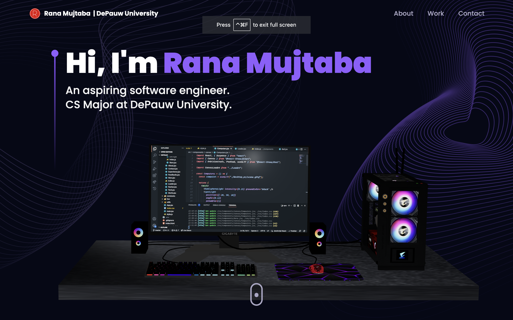

# 3D Portfolio website
I created my project using Three.js, React, and Tailwind CSS. It serves as a platform to showcase my skills and work to potential employers. With Three.js, I can incorporate captivating 3D graphics and animations, adding an exciting visual dimension to my portfolio. React enables me to build interactive elements like navigation menus and content sections, ensuring a smooth and engaging user experience. Tailwind CSS helps maintain a responsive and consistent design across different devices. Overall, this combination of technologies allows me to leave a strong impression on visitors by presenting my talents and projects in a dynamic and professional manner

